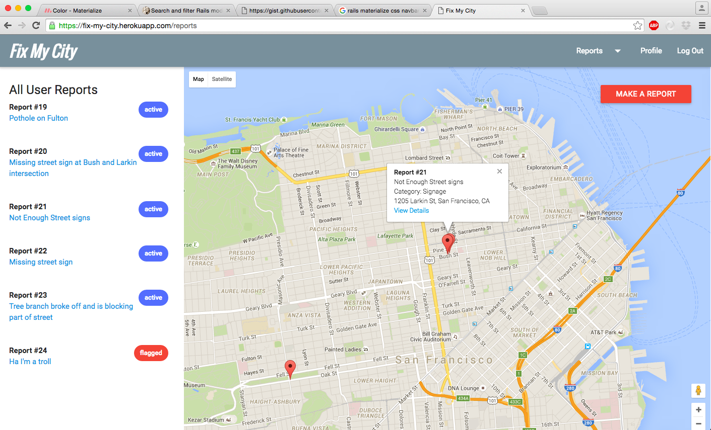

# Fix My City

##### This project is a full-stack prototype of an app to report public works issues on-the-go. It's long-term purpose is make it easier to report issues as well as to democratize the process and promote transparency. This first iteration focuses on preliminary admin abilities to filter and process user-generated reports and will continue to scale into a more robust cataloguing system and user flow for both the admin and the user interface.  


[Heroku Link] (https://fix-my-city.herokuapp.com/)

---

### Technologies Used
* Ruby on Rails
* PostgreSQL
* Active Record
* HTML/CSS
* Materialize CSS
* JavaScript
* JQuery
* Geocoder
* Google Maps API

---

### Future Features
* A filtering system for reports by status, category, vote count, and danger level
* Voting by users
* Users can upload pictures to their own reports as well as to others
* Map markers differentiated by report features

---

### Installation
Clone or fork this repo and run `bundle install`

Make sure to run the following commands as well:

```
rake db:create
rake db:migrate
rake db:seed
```

---

### Screenshots



#### Wireframes
[Wireframes](https://drive.google.com/file/d/0BzrMT0_EhgQQNEgzN2dTaldjSkdGQW9CcHl2b2ExZ2MxdmQ0/view?usp=sharing)

#### ERD
[ERD](https://drive.google.com/file/d/0BzrMT0_EhgQQeWgtc2poNHFPaDAyalRBY3hQazMtaVM5Mmdr/view?usp=sharing)

#### User Stories
[In-Progress User Stories](https://docs.google.com/document/d/1NeaSV7VfQ83cLsrWC00vbU430tkuhC8d-SqvqPdfAF0/edit?usp=sharing)
